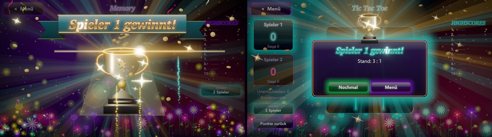

# Glamour Games – Unity Edition

**10 glitzernde Spiele – zu zweit an einem PC, per Bluetooth (auch mit dem Handy) oder gegen den Computer.**
Neuauflage der [Glamour Games für Windows](https://github.com/domezos2024/glamour_games_windows) mit Unity 6.3 LTS,
HDR-Neon-Grafik und einem Computer-Gegner in drei Stärken für **jedes** Spiel.

## Download

**[Neueste Version herunterladen](https://github.com/domezos2024/glamour_games_unity/releases/latest)**: entweder `GlamourGames-<Version>-Setup.exe` (Installer mit Startmenü-/Desktop-Verknüpfung und Deinstallation) oder `GlamourGames-<Version>-win-x64.zip` (ohne Installation: entpacken, `GlamourGames.exe` starten).
Voraussetzungen: Windows 10/11 (64 Bit), Grafikkarte mit DirectX 11/12.

## Neu in 2.3 – Physik- und Bluetooth-Update

* **Bluetooth-Mehrspieler:** alle 10 Spiele zu zweit an zwei Geräten – PC mit PC, PC mit Android-Handy oder Handy mit Handy. Geräte im Betriebssystem koppeln, im Menü (Symbol oben links) auf einem Gerät **eröffnen**, auf dem anderen **beitreten**; der Eröffner wählt das Spiel, der Mitspieler folgt automatisch.
* **Realistische Physik:** echte Fallbeschleunigung je nach Objektgröße, Stöße mit Restitution und Reibung, Kippen, Rollen und Kreiseln. Kniffel-Würfel stoßen aneinander und lassen sich per Wischgeste werfen, Vier-Gewinnt-Steine klappern im Schacht und rollen nach dem Öffnen der Bodenklappe weg, Karten rutschen über den Filz, Chips fallen auf den Stapel, Walzen rasten federnd ein, Schiffe schaukeln und sinken mit Schlagseite, der Pokal fällt auf den Sockel und kippelt aus.
* **Gleicher Code wie die Android-Version** ([glamour_games_unity_android](https://github.com/domezos2024/glamour_games_unity_android)).

## Neu in 2.2 – Sieger-Update (Grafik & Effekte)

* **Echter 3D-Siegerpokal:** prozedurales Modell (Kelch mit Lippe und Innenwand, Henkel, Nodus, Stern, Klavierlack-Sockel mit Goldleiste und Plakette) in **PBR-Gold**, das eine eigene HDR-Studioumgebung spiegelt; Glanzlichter leuchten über den Bloom. Eigene Kamera in Bildschirmauflösung – gestochen scharf bis 4K.
* **Kinoreife Siegesinszenierung:** Abdunklung mit Lichtkegel, weiche gegenläufige Lichtstrahlen, aufsteigender, sich drehender Pokal, anamorphotischer Linsenreflex mit Geisterbildern, Sternfilter-Glitzer und ein **Satinband-Banner mit Goldschrift** (Chrom-Horizont, Kantenschliff, wandernder Glanzstreif).
* **Sieger-Dialog** mit Pokal, Strahlenkranz, Goldrahmen und Lichtreflex, der über den Rand läuft.
* **Neue Partikel:** geprägte, rotierende **Goldmünzen** (Regen und Fontäne), Folien-Konfetti mit Spiegelblitzen, beleuchtetes Konfetti, wehende **Luftschlangen**, Trauerweiden- und Knister-Feuerwerk.
* **Postprocessing:** 64-Bit-HDR (keine Farbstufen in Verläufen), Bloom mit prozeduralem **Linsenschmutz**, HDR-Farbkorrektur, bei Siegen kurzer Bloom-Impuls mit **Screen-Space-Lens-Flare**; schärfere Bildatlas-Filterung.

 Software-Vorschau (2D-Ersatzpokal, ohne Bloom); im Unity-Player erscheinen der echte 3D-Pokal und das HDR-Postprocessing.

## Neu in 2.1 – Realismus-Update

* **Kniffel:** echte 3D-Würfel (abgerundet, eingelassene Augen) mit **physikalischem Wurf** (Starrkörper-Simulation, Aufprall-Geräusche) und echten Schatten auf dem Filz.
* **Physikalisch basierte Beleuchtung** (GGX, Fresnel, Studio-Spiegelungen) für Kugeln, Spielsteine, Goldbarren und Knöpfe.
* **Schiffe Versenken:** detaillierte 3D-Kriegsschiffe (Brücke, Geschütztürme, Schornsteine, Holzdeck) auf animiertem Wasser mit Kaustik und Gischt.
* **Casino:** 3D-Chipstapel, Filztische mit Lederbande, Karten mit Dicke, Papierstruktur und Glanz.
* **Münzwurf:** 3D-Goldmünze mit Prägung und geriffeltem Rand; **Vier Gewinnt:** echte Spielsteine; **Slot:** zylindrische Walzen.
* Schärfere Darstellung (kein Bloom auf Schrift, keine Farbsäume) und funktionierender Ton.

## Was ist neu gegenüber der Windows-Version?

| | Windows 1.8.1 (SkiaSharp) | Unity Edition 2.0 |
| --- | --- | --- |
| Rendering | Skia, Glow per Weichzeichner | GPU-Signed-Distance-Renderer, **HDR-Bloom** mit Linsenschmutz, Tonemapping, Farbkorrektur, Vignette, Lens-Flare bei Siegen |
| Auflösung | 1600 × 900 skaliert | gestochen scharf bis 4K (Formen und Schriften als Distanzfelder) |
| Hintergrund | Farbverläufe, Sterne | animierter Nebel (Domain-Warping), 3 Sternschichten, Polarlicht – komplett im Shader |
| Kugeln & Steine | Verlaufsfüllung | beleuchtete 3D-Kugeln mit Glanz- und Randlicht |
| Partikel | max. 360 | bis 2600, additive HDR-Funken, Feuerwerk mit Glitzer |
| Gegner | meist nur 2 Spieler | **jedes Spiel auch gegen den Computer** (Leicht / Mittel / Schwer) |

## Die 10 Spiele und ihr Computer-Gegner

| Taste | Spiel | Computer-Gegner |
| :-: | --- | --- |
| 1 | **Memory** | merkt sich aufgedeckte Karten (Gedächtnis je nach Stärke) |
| 2 | **Tic Tac Toe** | bis zum perfekten Minimax (Schwer verliert nie) |
| 3 | **Vier Gewinnt** | Alpha-Beta-Suche mit Stellungsbewertung, rechnet im Hintergrund |
| 4 | **Schiffe Versenken** | Zufall → Jagd-/Zielmodus → Wahrscheinlichkeitskarte |
| 5 | **Snake** | Solo wie gewohnt oder Duell gegen eine Computer-Schlange |
| 6 | **Kniffel** | Halte-Entscheidungen per Erwartungswert |
| 7 | **Nim** | Nim-Summen-Strategie |
| 8 | **Buch der Pharaonen** | Solo oder Duell über 10 Runden gegen den Computer |
| 9 | **Black Jack** | Basisstrategie für Spieler 2 |
| 0 | **Poker** | Monte-Carlo-Gewinnchance, Pot-Odds, Bluffs; 2 Menschen + Computer oder 1 Mensch gegen 2 Computer |

Die Gegnerwahl erscheint beim Start jedes Spiels und lässt sich im Spiel jederzeit über den Knopf „Gegner“ ändern.

 
 

 Screenshots aus der Software-Vorschau (Tools/Preview); im Unity-Player kommt zusätzlich das volle URP-Bloom hinzu.

## Projekt öffnen

1. **Unity Hub** → *Add project from disk* → diesen Ordner wählen. Empfohlen: **Unity 6.3 LTS (6000.3.x)**
   mit dem Modul *Windows Build Support*.
2. Beim ersten Öffnen richtet sich das Projekt selbst ein (`Assets/Glamour/Editor/ProjectBootstrap.cs`):
   URP-Pipeline mit HDR und 4× MSAA, Startszene `Assets/Scenes/Main.unity`, Build-Einstellungen,
   Produktname, Icon, Fenster 1600 × 900, Linear-Farbraum. Manuell: Menü **Glamour Games → Projekt einrichten**.
3. **Play** drücken – die App startet sich in jeder Szene selbst.
4. Windows-Build: Menü **Glamour Games → Windows-Build erstellen** (Ausgabe `Builds/Windows/GlamourGames.exe`)
   oder per Kommandozeile:
   `Unity -batchmode -quit -projectPath . -executeMethod GlamourGames.EditorTools.ProjectBootstrap.CiBuild`

> Die von Unity 6000.3.25f1 erzeugten `.meta`-Dateien und `ProjectSettings` sind eingecheckt (GUIDs stabil).

## Bedienung

| Aktion | So geht's |
| --- | --- |
| Spiel starten | Kachel anklicken oder Zifferntaste 1 … 0 |
| Gegner wählen | Dialog beim Spielstart oder Knopf „Gegner“ im Spiel |
| Optionen | Zahnrad oben rechts im Menü |
| Zurück zum Menü / Beenden | `Esc` |
| Vollbild | `F11` oder Optionen |
| Musik / Effekte | Symbole oben rechts, `M` stumm, `N` nächstes Stück |
| FPS-Anzeige | `F3` |

## Technik

* **Unity 6.3 LTS**, Universal Render Pipeline 17.3, C# 9, keine Fremd-Assets.
* `Assets/Glamour/Scripts/Core` – Engine: `Canvas2D` (Sofortmodus-Renderer, ein Draw-Call pro Frame), Shader
  `Glamour/Shape` und `Glamour/Backdrop`, SDF-Schrift- und Bildatlas, Szenen/UI, Partikel, prozedurale Musik und
  Soundeffekte, Karten, 3D-Würfel, Münzwurf, Sieger-Parade, Gegnerwahl.
* `Assets/Glamour/Scripts/Games` – Menü, Optionen und die 10 Spiele inkl. KI.
* `Assets/Glamour/Scripts/URP` – Postprocessing (Bloom & Co.), zur Laufzeit erzeugt.
* `Tools/build_assets.py` – baut Schrift- und Bildatlas aus `SourceArt/`.
* `Tools/Preview` – Software-Rasterizer, der Szenen **ohne Unity** als PNG rendert (Tests, Screenshots):
  `Tools/Preview/preview.sh --scene=menu --t=2 --out=menu.png`
* `Tools/Installer/GlamourGames.iss` – Inno-Setup-Skript für den Windows-Installer.
* `Tools/compile_check.sh` – Kompilier-Check gegen die Unity-Referenz-DLLs ohne Editor.

Entwickler-Referenz: [docs/ENGINE.md](docs/ENGINE.md)

## Lizenz

Quellcode unter der [MIT-Lizenz](LICENSE). Schriften und Grafiken: siehe [Third-Party Notices](THIRD_PARTY_NOTICES.md).

 
<b>Glamour Games 2.2 – Unity Edition</b> – erstellt von Michael Bergfeld @ DoMeZos-Ware 2026

